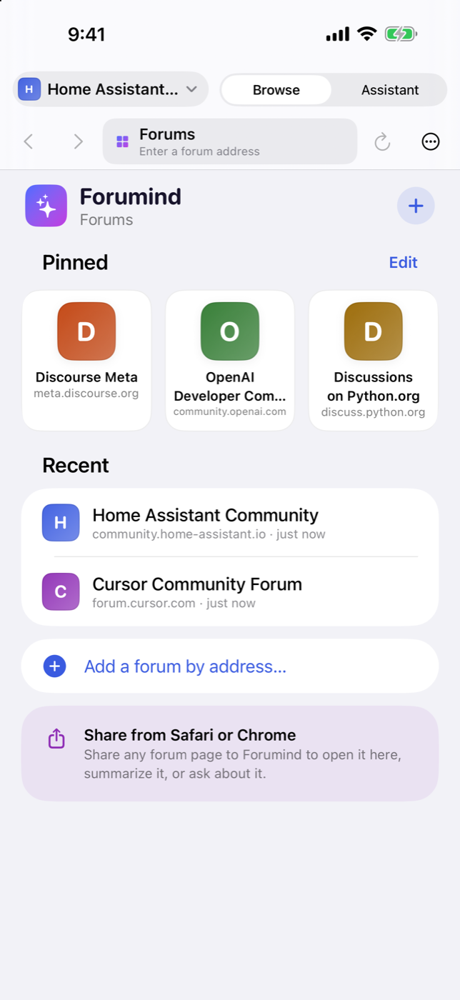
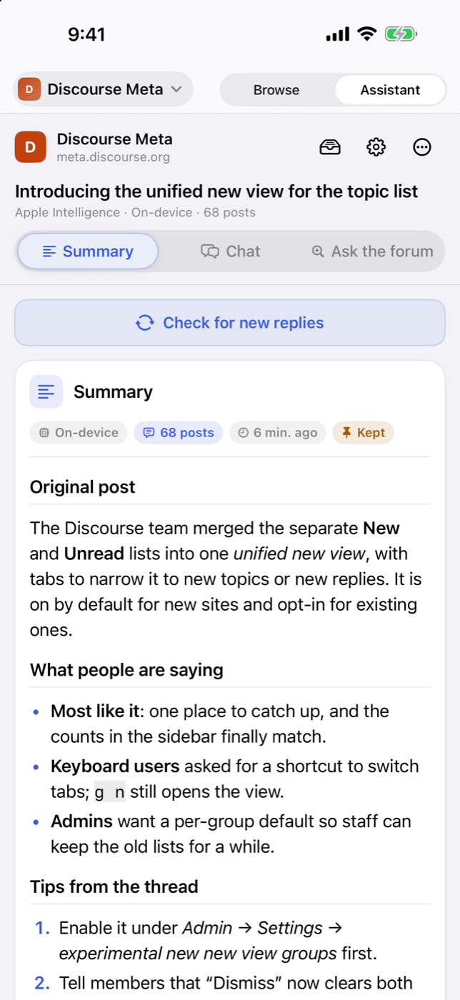
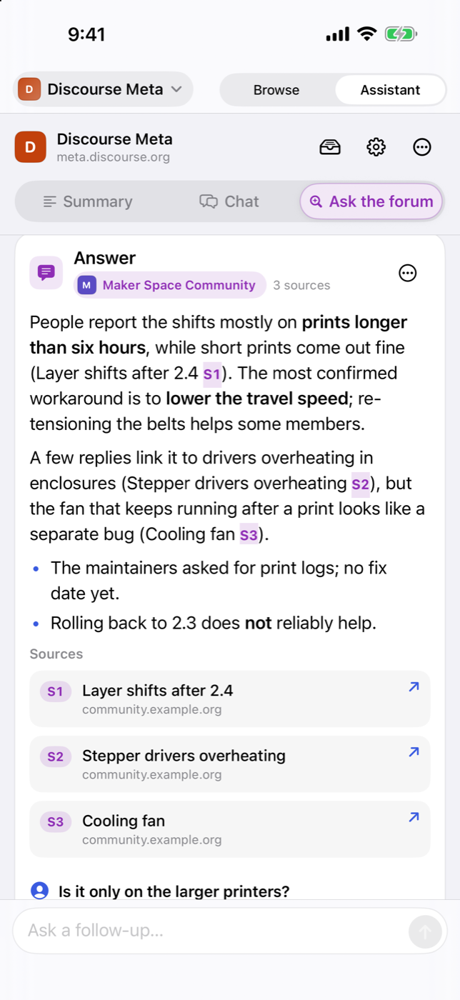
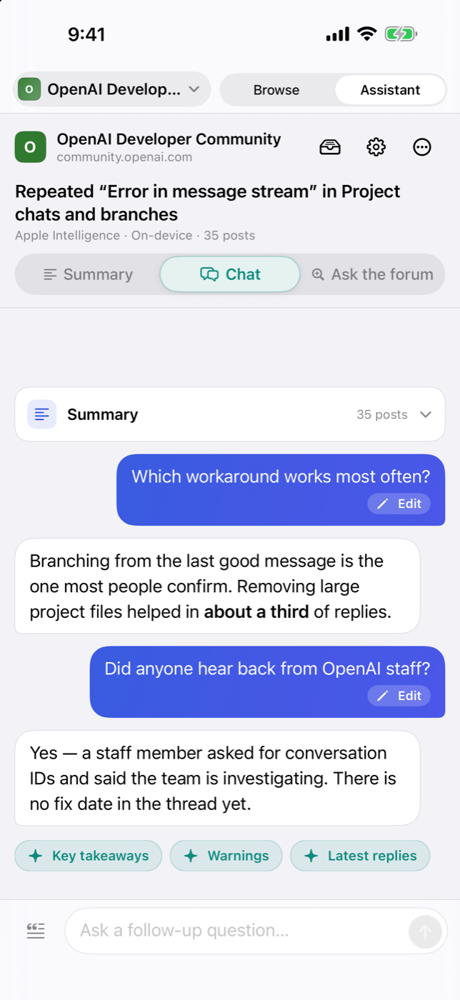
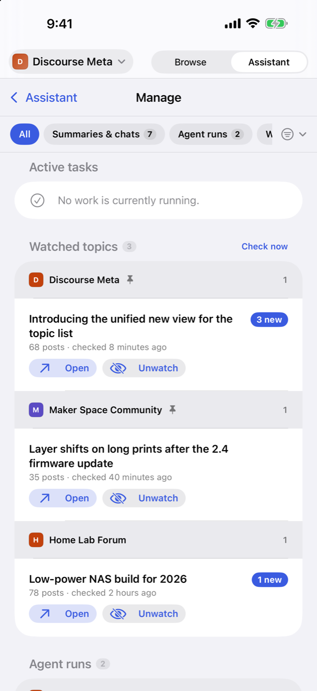
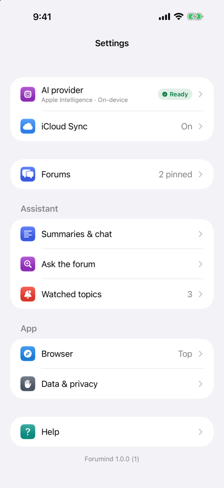
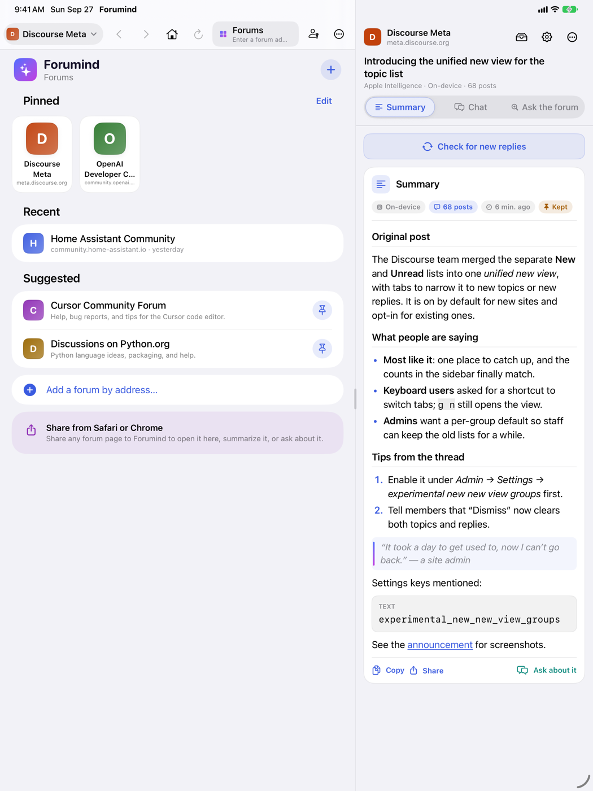

# Forumind for iPhone and iPad

**Catch up on any Discourse forum in seconds.** Summarize long topics, ask
follow-up questions, and let AI search the whole forum for you, with links to
the posts it used.

Forumind is a free, open-source iPhone and iPad app: a forum browser
with an AI assistant beside it. It works with any forum built on
[Discourse](https://www.discourse.org), like
[meta.discourse.org](https://meta.discourse.org), or your own community.

**App Store: coming soon.** Until then, you can [build it yourself](#build-it-yourself).

<p>
  
  
  
</p>

## What it does

- **Summaries.** Get the main points of a 500-reply topic without reading
  every post: the original post, what people are saying, and tips from the
  thread. Later, **Check for new replies** reads only what's new.
- **Chat.** Ask about the topic you're reading: "What did people decide?" or
  "Is there a workaround?"
- **Ask the forum.** Ask a question and the assistant searches the forum,
  reads the best topics, and answers with numbered sources you can tap.
- **Any Discourse forum.** Open a forum and the app recognizes it. Pin your
  favorites on the **Forums** home; forums you visit show up under Recent.
- **Share from Safari or Chrome.** Share any forum page to Forumind
  to open it, summarize it, chat about it, or ask the forum.
- **Watch topics.** Get a notification when a topic has new replies.
- **Built-in ad and tracker blocking** in the browser, using EasyList and
  EasyPrivacy.
- **iCloud sync.** Forums, summaries, chats, and settings follow you between
  your iPhone and iPad automatically, end-to-end encrypted in your own iCloud
  account; API keys sync through iCloud Keychain.
- **iPhone and iPad.** On iPad the forum and the Assistant sit side by side.

<p>
  
  
  
</p>



## Choose your AI

**Apple Intelligence** is the easiest option: on devices that support it, the
app uses Apple's on-device model, and Private Cloud Compute where available,
with no account and no API key. It's picked automatically when it's
available.

Or **bring your own provider**. Paste an API key once and the app suggests a
good model:

| Provider | What you need | Good to know |
| --- | --- | --- |
| OpenRouter | An API key | One key, many models |
| OpenAI | An API key | GPT models |
| Anthropic | An API key | Claude models |
| Google Gemini | An API key | Gemini models |
| Groq | An API key | Fast open models |
| xAI | An API key | Grok models |
| DeepSeek | An API key | DeepSeek models |
| NVIDIA NIM | An API key from build.nvidia.com | Open models, OpenAI-compatible |
| Ollama | Ollama on a computer on your network | Free, private, no key |
| LM Studio | LM Studio on a computer on your network | Free, private, no key |

**Not sure?** Use Apple Intelligence if your device has it. Otherwise, if you
already pay for one of these, use that one; to try many models with one key,
OpenRouter is an easy start. For Ollama or LM Studio, enter the computer's
address (for example `http://192.168.1.20:11434`) as the base URL.

## Get started

1. **Pick your AI.** The first launch walks you through it. You can skip it
   and choose later in Settings.
2. **Pick your forums.** Pin a suggested forum or add one by address
   (`meta.discourse.org`, or a subfolder forum like `example.com/forum`).
3. **Open a topic and tap Assistant.** Choose **Summary**, **Chat**, or
   **Ask the forum**.

If a forum needs you to log in, log in inside the app's browser. The app
reads the forum the way the browser does, so it can read what you can read.

**Sync between iPhone and iPad** is automatic: sign in to the same Apple
Account on both, and your forums, summaries, chats, and settings follow you.
Check it or turn it off in **Settings › iCloud Sync**. (Sync needs a build
signed with a paid team; see
[docs/DEVELOPMENT.md](docs/DEVELOPMENT.md#icloud-sync-cloudkit-and-signing).)

## Privacy in plain words

- **No middleman.** There are no Forumind servers, accounts,
  analytics, ads, or tracking.
- **Forum posts go only to the AI you chose**, straight from your device. With
  Apple Intelligence, they stay on your device or go to Apple's Private Cloud
  Compute.
- **Your keys stay in your Keychain** (and iCloud Keychain, if you sync them).
- **Your history stays yours:** on your device and, with sync, end-to-end
  encrypted in your own iCloud account, where nobody else can read it.
- **Each forum's login stays with that forum.** Cookies are sent only to the
  forum they belong to.

Full details: [Privacy Policy](PRIVACY.md).

## FAQ

**Does it cost anything?**
The app is free. Apple Intelligence and local models cost nothing to use.
Other AI providers may charge for usage, usually a small amount per summary.

**Is this made by Discourse?**
No. Forumind is an independent open-source app for Discourse forums. It
is not affiliated with or endorsed by Civilized Discourse Construction Kit,
Inc. or any forum.

**Which forums work?**
Any forum running Discourse, public or private (log in inside the app). The
app tells you when a page isn't a Discourse forum.

**How long is my history kept?**
Summaries are kept (the 40 most recent, plus everything you **Keep**). Chats
and activity you haven't kept are cleared after a day. **Settings › Data &
privacy** deletes data per forum or all at once.

**The forum asks me to slow down.**
The app waits and retries on its own when a forum rate-limits it.

**Does it keep working in the background?**
Work keeps going while you browse other topics in the app. iOS may pause it
when you switch to another app; it resumes when you come back.

**Can I use it on a desktop browser?**
Also available as a
[Chrome extension](https://github.com/kccarlos/DiscourseCopilot).

## Build it yourself

You need a Mac with Xcode 27 and the `xcodeproj` Ruby gem:

```sh
git clone https://github.com/kccarlos/forumind.git
cd forumind
gem install xcodeproj
ruby scripts/generate_project.rb
open Forumind.xcodeproj
```

Run it on a simulator right away. To install on your own iPhone or iPad, set
your signing team first; see [docs/DEVELOPMENT.md](docs/DEVELOPMENT.md#signing).

## For developers

- [Development](docs/DEVELOPMENT.md): setup, signing, tests, DEBUG launch
  arguments
- [Architecture](docs/ARCHITECTURE.md): how the app is put together
- [CI/CD](docs/CI.md): GitHub Actions, TestFlight, releases
- [Ad blocking](docs/AD_BLOCKING.md): how the filter lists are converted and
  loaded
- [iCloud sync](docs/SYNC.md): CloudKit sync, merge rules, encryption
- [Apple Intelligence](docs/APPLE_INTELLIGENCE.md): on-device and Private
  Cloud Compute
- [App Store](docs/APP_STORE.md): release checklist

Contributions are welcome; see [CONTRIBUTING.md](CONTRIBUTING.md). Please
report security issues privately ([SECURITY.md](SECURITY.md)).

## License

Forumind is licensed under the [Apache License 2.0](LICENSE). The
bundled ad-blocking rules are derived from EasyList and EasyPrivacy and are
licensed under CC BY-SA 3.0; see [NOTICE](NOTICE).

Forumind is an independent app and is not affiliated with or endorsed by
Civilized Discourse Construction Kit, Inc. Discourse is a trademark of its
respective owner.
