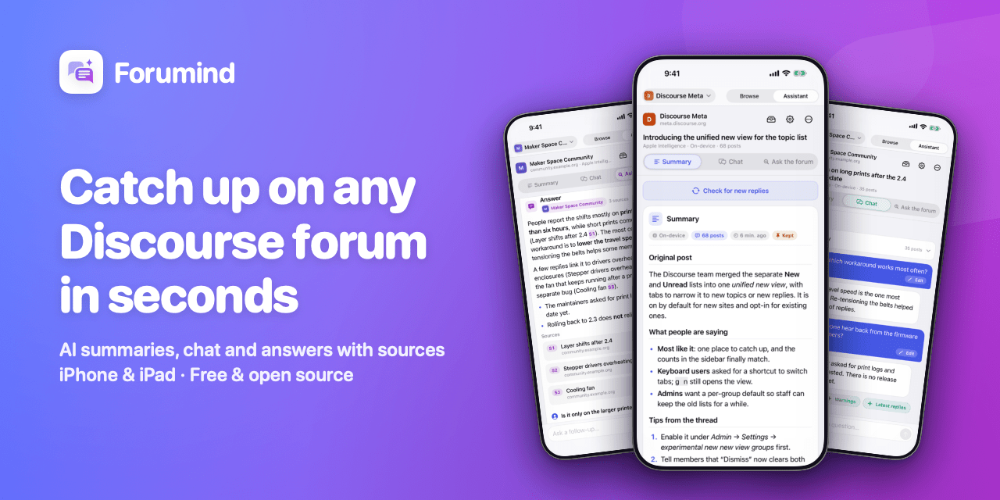
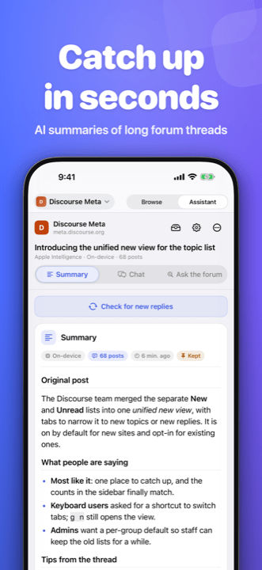
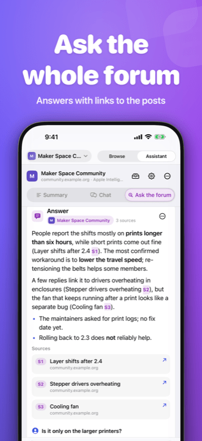
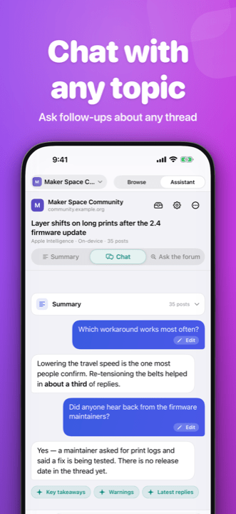
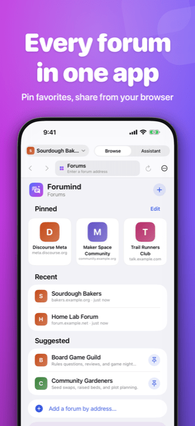
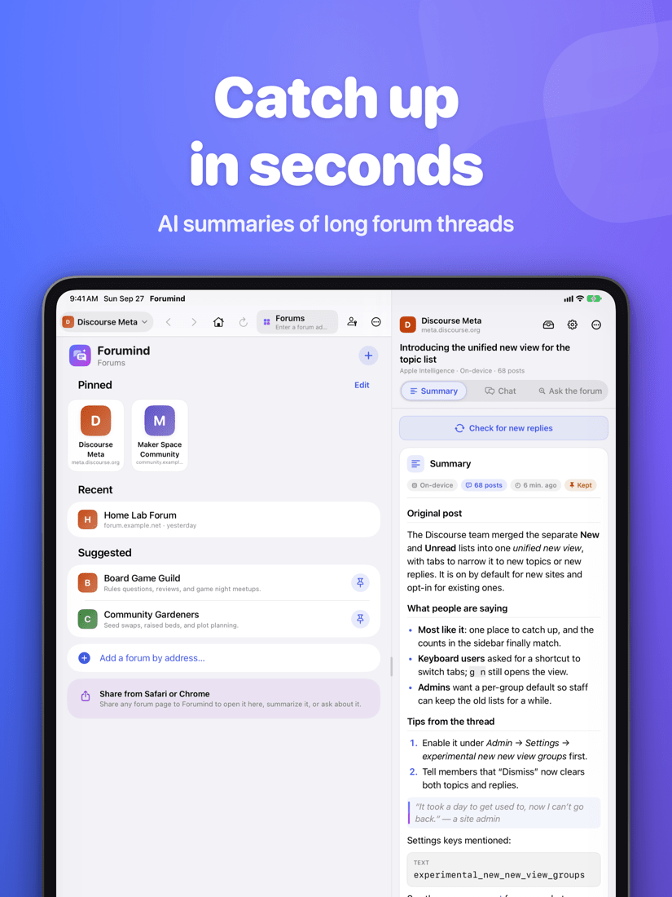

<p align="center">
  
</p>

<h3 align="center">A forum browser with an AI assistant beside it, for any Discourse forum.</h3>

<p align="center">
  <a href="https://apps.apple.com/app/id6816718686"></a>
  <a href="LICENSE"></a>
  
  
  
  <a href="https://github.com/kccarlos/forumind/stargazers"></a>
</p>

<p align="center">
  <b>English</b> · <a href="README.zh-Hans.md">简体中文</a> · <a href="README.zh-Hant.md">繁體中文</a>
</p>

**Catch up on any Discourse forum in seconds.** Summarize long topics, ask
follow-up questions, and let AI search the whole forum for you, with links to
the posts it used. Forumind is a free, open-source app for iPhone and iPad
that works with any forum built on [Discourse](https://www.discourse.org),
like [meta.discourse.org](https://meta.discourse.org), or your own community.

> **App Store:** Forumind has been submitted and is in review. The
> [App Store link](https://apps.apple.com/app/id6816718686) goes live once
> Apple approves it. Until then, you can [build it yourself](#build-from-source).

**Prefer your desktop browser?** Forumind's sibling is a Chrome extension: [DiscourseCopilot](https://github.com/kccarlos/DiscourseCopilot).

## Why Forumind

- **Read less, know more.** Get the main points of a 500-reply topic without reading every post.
- **Ask, don't dig.** Ask the forum a question and get an answer with numbered sources you can tap.
- **Any Discourse forum.** Public or private, big or small, including your own community.
- **Your AI, your choice.** Apple Intelligence with no key, your own provider, or a model on your own computer.
- **Private by design.** No Forumind servers, accounts, analytics, ads, or tracking.
- **Free and open source.** Apache-2.0, built with SwiftUI for iPhone and iPad.

## Screenshots

<p align="center">
  
  
  
  
</p>
<p align="center">
  
</p>

## Features

### Understand any topic

- **Summaries.** The original post, what people are saying, and tips from
  the thread. Later, **Check for new replies** reads only what's new.
- **Chat.** Ask about the topic you're reading: "What did people decide?" or
  "Is there a workaround?"
- **Ask the forum.** Ask a question and the assistant searches the forum,
  reads the best topics, and answers with numbered sources you can tap.

### All your forums in one place

- **Any Discourse forum.** Open a forum and the app recognizes it. Pin your
  favorites on the **Forums** home; forums you visit show up under Recent.
- **Share from Safari or Chrome.** Share any forum page to Forumind to open
  it, summarize it, chat about it, or ask the forum.
- **Watch topics.** Get a notification when a topic has new replies.
- **iPhone and iPad.** On iPad the forum and the Assistant sit side by side.

### The right AI for each job

- **Apple Intelligence or your own provider.** See [Choose your AI](#choose-your-ai).
- **Two default models.** One for **Summaries & chat**, one for **Ask the
  forum**, so each job gets the model that suits it.

### Private, in sync, and polite

- **iCloud sync.** Forums, summaries, chats, and settings follow you between
  your iPhone and iPad automatically, end-to-end encrypted in your own iCloud
  account; API keys sync through iCloud Keychain.
- **Polite to forum servers.** Topics are read one page per second by
  default (Settings › Summaries & chat › Forum requests), and each forum is
  paced on its own. When a forum asks the app to slow down, it waits and
  retries.
- **Optional ad and tracker blocking** in the browser, using EasyList and
  EasyPrivacy. It's off by default, out of respect for forum owners who rely
  on ads; turn it on in Settings › Browser.
- **In your language.** English, Simplified Chinese, and Traditional Chinese.

## Choose your AI

**Apple Intelligence** is the easiest option: on devices that support it, the
app uses Apple's on-device model, and Private Cloud Compute where available,
with no account and no API key. It's picked automatically when it's
available.

Or **bring your own provider**. Paste an API key once and the app suggests a
good model:

| Provider | What you need | Good to know |
| --- | --- | --- |
| OpenRouter | An API key | One key, many models |
| OpenAI | An API key | GPT models |
| Anthropic | An API key | Claude models |
| Google Gemini | An API key | Gemini models |
| Groq | An API key | Fast open models |
| xAI | An API key | Grok models |
| DeepSeek | An API key | DeepSeek models |
| NVIDIA NIM | An API key from build.nvidia.com | Open models, OpenAI-compatible |
| Ollama | Ollama on a computer on your network | Free, private, no key |
| LM Studio | LM Studio on a computer on your network | Free, private, no key |

**Not sure?** Use Apple Intelligence if your device has it. Otherwise, if you
already pay for one of these, use that one; to try many models with one key,
OpenRouter is an easy start. For Ollama or LM Studio, enter the computer's
address (for example `http://192.168.1.20:11434`) as the base URL.

**Two models, one for each job.** Settings › AI models has a default model
for **Summaries & chat** and one for **Ask the forum**. Summaries and chat
read a lot of text, so a fast, low-cost model works well there; Ask the forum
plans searches and reasons over what it reads, so a stronger model pays off.
Both start as the model you pick during setup; change either one, or switch
from the Assistant's menu, and the other stays as it is. Keys belong to a
provider, so two models from the same provider share one key.

## Get Forumind

### App Store

Forumind is in App Store review. Once Apple approves it, it will be here:
**[Forumind on the App Store](https://apps.apple.com/app/id6816718686)**.

### Build from source

You need a Mac with Xcode 27 and the `xcodeproj` Ruby gem:

```sh
git clone https://github.com/kccarlos/forumind.git
cd forumind
gem install xcodeproj
ruby scripts/generate_project.rb
open Forumind.xcodeproj
```

Run it on a simulator right away. To install on your own iPhone or iPad, set
your signing team first; see [docs/DEVELOPMENT.md](docs/DEVELOPMENT.md#signing).

### First steps

1. **Pick your AI.** The first launch walks you through it. You can skip it
   and choose later in Settings.
2. **Pick your forums.** Pin a suggested forum or add one by address
   (`meta.discourse.org`, or a subfolder forum like `example.com/forum`).
3. **Open a topic and tap Assistant.** Choose **Summary**, **Chat**, or
   **Ask the forum**.

If a forum needs you to log in, log in inside the app's browser. The app
reads the forum the way the browser does, so it can read what you can read.

**Sync between iPhone and iPad** is automatic: sign in to the same Apple
Account on both, and your forums, summaries, chats, and settings follow you.
Check it or turn it off in **Settings › iCloud Sync**. (Sync needs a build
signed with a paid team; see
[docs/DEVELOPMENT.md](docs/DEVELOPMENT.md#icloud-sync-cloudkit-and-signing).)

## Privacy in plain words

- **No middleman.** There are no Forumind servers, accounts,
  analytics, ads, or tracking.
- **Forum posts go only to the AI you chose**, straight from your device. With
  Apple Intelligence, they stay on your device or go to Apple's Private Cloud
  Compute.
- **Your keys stay in your Keychain** (and iCloud Keychain, if you sync them).
- **Your history stays yours:** on your device and, with sync, end-to-end
  encrypted in your own iCloud account, where nobody else can read it.
- **Each forum's login stays with that forum.** Cookies are sent only to the
  forum they belong to.

Full details: [Privacy Policy](PRIVACY.md).

## FAQ

<details>
<summary><b>Does it cost anything?</b></summary>

The app is free. Apple Intelligence and local models cost nothing to use.
Other AI providers may charge for usage, usually a small amount per summary.
</details>

<details>
<summary><b>Is this made by Discourse?</b></summary>

No. Forumind is an independent open-source app for Discourse forums. It
is not affiliated with or endorsed by Civilized Discourse Construction Kit,
Inc. or any forum.
</details>

<details>
<summary><b>Which forums work?</b></summary>

Any forum running Discourse, public or private (log in inside the app). The
app tells you when a page isn't a Discourse forum.
</details>

<details>
<summary><b>How long is my history kept?</b></summary>

Summaries are kept (the 40 most recent, plus everything you **Keep**). Chats
and activity you haven't kept are cleared after a day. **Settings › Data &
privacy** deletes data per forum or all at once.
</details>

<details>
<summary><b>The forum asks me to slow down.</b></summary>

The app waits and retries on its own when a forum rate-limits it.
</details>

<details>
<summary><b>Does it keep working in the background?</b></summary>

Work keeps going while you browse other topics in the app. iOS may pause it
when you switch to another app; it resumes when you come back.
</details>

<details>
<summary><b>Can I use it on a desktop browser?</b></summary>

Also available as a
[Chrome extension](https://github.com/kccarlos/DiscourseCopilot).
</details>

## For developers

- [Development](docs/DEVELOPMENT.md): setup, signing, tests, DEBUG launch
  arguments
- [Architecture](docs/ARCHITECTURE.md): how the app is put together
- [CI/CD](docs/CI.md): GitHub Actions, TestFlight, releases
- [Ad blocking](docs/AD_BLOCKING.md): how the filter lists are converted and
  loaded
- [iCloud sync](docs/SYNC.md): CloudKit sync, merge rules, encryption
- [Apple Intelligence](docs/APPLE_INTELLIGENCE.md): on-device and Private
  Cloud Compute
- [App Store](docs/APP_STORE.md): release checklist

## Contributing

Contributions are welcome: bug reports, ideas, translations, docs, and code.
See [CONTRIBUTING.md](CONTRIBUTING.md) and the
[Code of Conduct](CODE_OF_CONDUCT.md). Please report security issues
privately ([SECURITY.md](SECURITY.md)).

If Forumind saves you time, a star on GitHub helps other people find it.

## License

Forumind is licensed under the [Apache License 2.0](LICENSE).

Forumind is an independent app and is not affiliated with or endorsed by
Civilized Discourse Construction Kit, Inc. Discourse is a trademark of its
respective owner.

## Acknowledgements

- The optional ad and tracker blocking uses rules derived from
  [EasyList and EasyPrivacy](https://easylist.to/), licensed under
  CC BY-SA 3.0; see [NOTICE](NOTICE).
- Built for the [Discourse](https://www.discourse.org) community, whose
  open platform makes forums like these possible.
