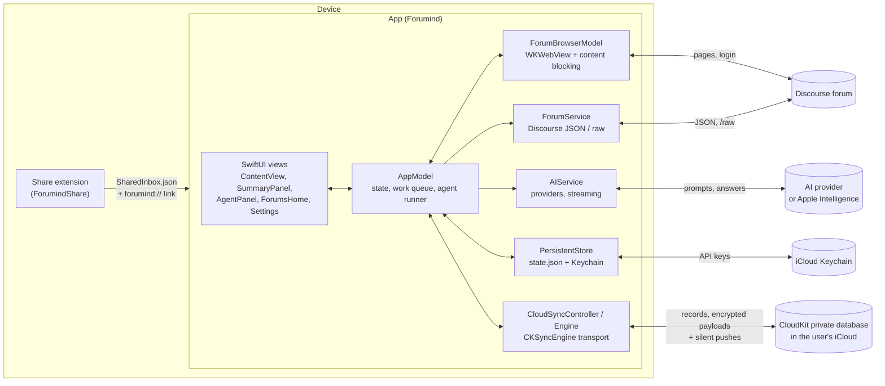
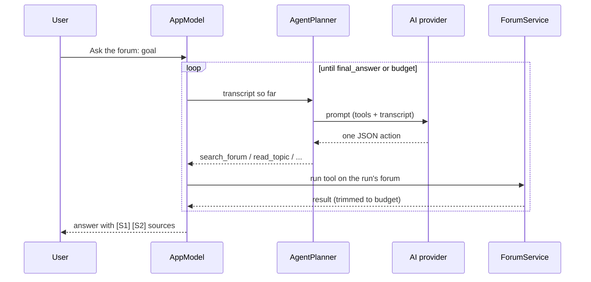
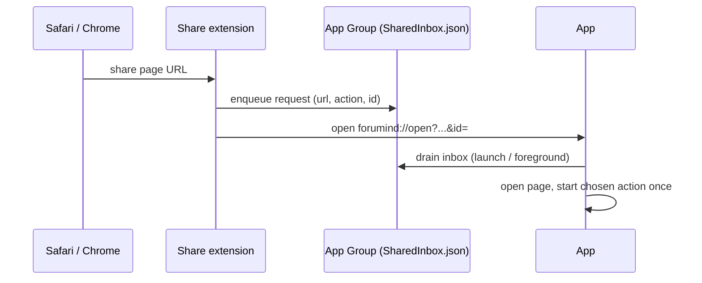

# Architecture

Forumind is a SwiftUI app with a `WKWebView` browser and an AI
assistant beside it, plus a share extension. It has no third-party
dependencies and no backend: the app talks directly to the forum and to the AI
provider the user chose.

## Module map

All app code is in `Forumind/`; files are grouped here by role.

### App shell and layout

| File | Role |
| --- | --- |
| `ForumindApp.swift` | App entry, `AppDelegate` (background refresh, notifications), scene setup. |
| `ContentView.swift` | Root view: browser, Assistant panel, Browse/Assistant switch, sheets. |
| `WorkspaceLayout.swift` | Side-by-side layout on wide windows (iPad landscape, large Stage Manager windows), resizable panel, keyboard commands. Narrow windows get a Browse / Assistant switch. |
| `DesignSystem.swift`, `ForumComponents.swift`, `AssistantStates.swift`, `MarkdownView.swift` | Shared styles, forum rows/tiles/switcher, Assistant empty/loading/not-a-forum states, and a small Markdown renderer. |

### Browser and forum identity

| File | Role |
| --- | --- |
| `ForumBrowser.swift` | `ForumBrowserModel` owns the `WKWebView`: navigation, the address bar, in-page probing, cookie handling, and attaching content-blocking rules. |
| `PageContext.swift` | What the Assistant knows about the current page. After each navigation (and Discourse SPA route change) an in-page probe checks `meta[name=generator]`, `discourse-base-uri`, and `#data-discourse-setup`; the page settles into `loading`, `notForum`, `maybe`, `forumHome`, or `topic`. |
| `ForumSite.swift` | Forum identity. A forum is its site URL: origin plus an optional base path for subfolder installs; https only (http for localhost). A topic key is `host[/basePath]/t/{id}`, unique across forums. URL builders and per-host cookie filtering live here. |
| `ForumDirectory.swift` | Pinned and recent forums, suggested forums, and "Add forum" address parsing and validation. |
| `ForumsHome.swift` | The Forums home screen and the forum switcher. |
| `ForumService.swift` | Discourse JSON and `/raw` endpoints for one forum per call, with incremental page caching and `Retry-After` handling. |

**Forum requests.** When the web view is showing the same forum, JSON and raw
requests run as `fetch()` inside that page, so the forum login and any
Cloudflare clearance are reused. Otherwise (another page is open, or a
background refresh) they go through `URLSession` with that forum's cookies
only; a redirect to another origin is followed without them
(`ForumRedirectGuard`).

### App state, work queue, and settings

| File | Role |
| --- | --- |
| `AppModel.swift` | The main-actor `AppModel`: published state, the work queue, summaries, chats, watched topics, persistence hooks. |
| `AppModel+Assistant.swift`, `+Browse.swift`, `+Onboarding.swift`, `+ContentBlocking.swift`, `+CloudSync.swift`, `+StateDebug.swift` | Feature slices of `AppModel` (and their DEBUG launch arguments). |
| `Models.swift` | Codable models: `AppSettings`, `TopicSession`, `AgentRun`, `WatchedTopic`, `WorkRecord`, provider configuration. |
| `WatchSupport.swift` | Local notifications and the Background App Refresh task for watched topics. |

**Work queue.** Summaries, chats, and agent runs are `WorkRecord`s. Two run at
once (`TaskLimiter`), with per-topic ordering, up to 50 queued, progress and
cancellation, and restore after relaunch. Finished activity is kept for 24
hours. Removing a forum together with its data cancels its work first.

**RunSettings.** Settings edits apply immediately to work that hasn't started;
work that is already running keeps a snapshot (`RunSettings`) of the provider,
model, prompts, and limits it started with. Deleting a key, switching
provider, or a synced settings change from another device never changes a run
midway.

**Summaries.** Discussions longer than the batch limit (default 55k
characters, 20k–1M in Settings; long-press the summary button to pick a size
for one run) are split into batches. Each batch is summarized, the batch
summaries are folded again while they still exceed the limit, and the result
becomes the final summary. **Check for new replies** reads only the new pages.
Summaries follow the discussion's language; chat and agent answers follow the
user's.

**Watched topics** are checked when the app comes to the foreground, every 30
minutes while it's open, and by a best-effort Background App Refresh task. New
replies post a local notification, mark the saved summary stale, and
optionally queue a refresh.

### AI providers

| File | Role |
| --- | --- |
| `AIService.swift` | Streaming chat/completion calls for every provider: OpenAI-compatible APIs (OpenAI, OpenRouter, Groq, xAI, DeepSeek, NVIDIA NIM, LM Studio), Anthropic, Google Gemini, and Ollama. Model listing and the "Test" check. |
| `PromptBuilder.swift` | System prompts, hierarchical batching, and chat context. |
| `SettingsProviderPage.swift`, `SettingsProviderForm.swift` | Provider choice, key entry, favorite models. |

Apple Intelligence (on-device and Private Cloud Compute) is a provider too;
see [APPLE_INTELLIGENCE.md](APPLE_INTELLIGENCE.md).

### Ask the forum (agent)

| File | Role |
| --- | --- |
| `AgentEngine.swift` | Tool specs, `AgentPlanner` / `PromptAgentPlanner`, and parsing of the model's actions. |
| `AgentPanel.swift` | The Ask the forum UI: goal, steps, answer with numbered sources, follow-ups. |

The agent is read-only. Its tools are `search_forum` (Discourse search
syntax), `list_latest`, `read_topic`, `summarize_topic`, `saved_summaries`,
`watch_topic`, and `final_answer`. The planner asks the model for one JSON
action per turn, so it works with every provider, including ones without
native tool calling. Each run belongs to one forum (`AgentRun.siteURL`): every
tool call and follow-up stays on it, topic ids from the model are reduced to
digits, and URLs are always built from the run's forum. Budgets (default 15
steps, 8 topic reads, 30k characters per read) are in Settings. Tools carry a
`requiresApproval` flag so a tool that writes to the forum would need the
user's confirmation. Topics the agent summarizes become ordinary saved
summaries.

### Share extension and incoming links

| File | Role |
| --- | --- |
| `ForumindShare/ShareViewController.swift`, `ShareSheetView.swift` | The share sheet UI: shows whether the page looks like Discourse and offers Summarize, Chat about it, Ask the forum, or Just open. |
| `ForumindShare/SharedPage.swift` | Parses what the host app shared (URL, title, Safari preprocessing results). |
| `ForumindShare/DiscourseProbe.js` | Safari preprocessing script that detects Discourse on the shared page. |
| `IncomingLink.swift` | Compiled into both targets. `IncomingLinkRequest`, the `forumind://open?url=…&action=…` format, and the App Group `SharedInbox`. |

The extension writes the request to the App Group inbox and opens the link;
the app drains the inbox on launch and foreground and handles each request id
once. Because any app or website can open a `forumind://` link, a link
that did not come through the share sheet only opens the page and the
Assistant; the user starts the summary. Unsigned simulator builds have no App
Group container, so the inbox is skipped there.

### Content blocking

`ContentBlocker.swift` (`ContentRuleLibrary`, `ContentBlocker`,
`ContentBlockingPolicy`) and `AppModel+ContentBlocking.swift` compile and attach
the bundled EasyList/EasyPrivacy rules in `ContentBlocking/`. Details:
[AD_BLOCKING.md](AD_BLOCKING.md).

### Sync

iCloud sync through CloudKit, on by default when an iCloud account is
available:

- `CloudSyncController.swift`: the status, on/off switch, account changes,
  and scheduling (`app.cloudSync`, main actor).
- `CloudSyncEngine.swift`: an actor with the mirror of the server's records,
  the baseline, and the plan of each pass (merge, apply, queue).
- `SyncRecords.swift`: the record model, units, merge rules, and payload
  encoding.
- `CloudSyncTransport.swift` (the transport protocol) and
  `CloudKitTransport.swift` (`CKSyncEngine`, zone `Forumind`, record type
  `SyncRecord` with an encrypted payload; compiled only with
  `CLOUDKIT_ENABLED`, which the generator sets for signed builds).
- `AppModel+CloudSync.swift`: app state to records and back
  (`applyRemote`).
- `SettingsSyncPage.swift`: Settings › iCloud Sync and the status text shared
  with the onboarding step.

`ForumindApp.swift`'s app delegate registers for remote notifications in
CloudKit builds. Details: [SYNC.md](SYNC.md).

### Persistence and Keychain

`Persistence.swift`:

- `PersistentStore` saves one `AppSnapshot` as `state.json` in Application
  Support (saves are coalesced). If a snapshot can't be decoded, it is copied
  aside as `state.unreadable-<timestamp>.json` before the app starts empty.
- `KeychainProviderKeyStore` keeps API keys out of the snapshot, as generic
  password items (synchronizable while **Sync API keys** is on).
- `KeychainSyncProbe.swift` is a DEBUG check that synchronizable Keychain
  items work with a build's signing.

History limits: chats and activity you haven't kept are cleared after a day;
the 40 most recent unkept summaries are kept, plus everything marked **Keep**;
the 50 most recent agent runs are kept.

## Tests

| Target | What it covers |
| --- | --- |
| `ForumindTests` | Unit tests: forum identity and URL building, the work queue and state transitions, incoming links, onboarding, agent sources, content blocking (compiles every bundled chunk in WebKit), CloudKit sync against a fake transport (two simulated devices), Keychain sync, iPad layout math. |
| `ForumindUITests` | UI tests on simulators (Forums home, onboarding, settings navigation, share hand-off, iPad layouts) and smoke tests for physical devices. |

See [DEVELOPMENT.md](DEVELOPMENT.md) for how to run them.
