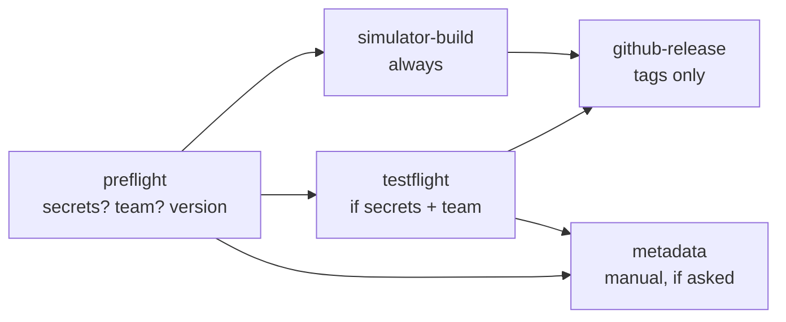

# CI / CD

Three GitHub Actions workflows live in `.github/workflows/`. The helper scripts
in `scripts/ci/` also run locally.

| Workflow | When | What |
| --- | --- | --- |
| `ci.yml` | Every pull request and push to `main` | Lint, project drift, unit tests, unsigned Release build |
| `release.yml` | Push to `main` (app changes), tags `v*`, or manual | TestFlight upload; for tags and manual runs also a simulator build, App Store metadata, GitHub Release |
| `update-filter-lists.yml` | Mondays, or manual | Refreshes the ad-blocking rules and opens a PR ([AD_BLOCKING.md](AD_BLOCKING.md)) |

## `ci.yml`

| Job | Runner | What it does |
| --- | --- | --- |
| `lint` | `ubuntu-latest` | Validates tracked `.plist`, `.entitlements`, and `.xcprivacy` files (`lint-plists.sh`); ShellChecks `scripts/ci` and `scripts/adblock`; runs the ad-blocking converter tests; checks App Store metadata lengths and screenshot sizes and opacity (`check-appstore-metadata.sh`); checks `fastlane/Fastfile` syntax; runs `actionlint`. |
| `project-drift` | `ubuntu-latest` | Runs `scripts/generate_project.rb` in a temporary copy and fails if the committed `Forumind.xcodeproj` differs (`check-project-drift.sh`). |
| `build-test` | `xcode-27` | Picks an iPhone simulator and runs the `ForumindTests` unit tests, unsigned. Uploads the `.xcresult` bundle on failure. |
| `release-build` | `xcode-27` | Builds the **Release** configuration for a generic iOS device, unsigned, to catch errors that only show up in Release (for example, code that is only compiled in DEBUG). |

A newer push to the same branch or pull request cancels the run in progress.
UI tests don't run in CI; run them locally
([DEVELOPMENT.md](DEVELOPMENT.md#ui-tests)).

**Project drift.** The generator creates random object UUIDs each run, so a
plain `git diff` would always report changes. The check compares the object
graph with UUIDs removed (`xcodeproj-tree.rb`) and the scheme without
`BlueprintIdentifier` lines. It always generates with the defaults (no team,
default bundle IDs, build 1, so no CloudKit and the committed base
entitlements), ignoring `DEVELOPMENT_TEAM`, `BUNDLE_ID_PREFIX`,
`BUILD_NUMBER`, `DC_ENABLE_PCC`, and `DC_ENABLE_CLOUDKIT`. To fix a failure,
run `env -u DEVELOPMENT_TEAM ruby scripts/generate_project.rb` (and without
the other variables, and without a `Config/DevelopmentTeam.txt`, which the
check never sees) and commit.

**iCloud sync in CI.** Pull request builds are unsigned and generated without
a team, so CloudKit is off in them: no iCloud entitlement and no
`CLOUDKIT_ENABLED`, and sync reports itself unavailable. That is intended: an
app that calls CloudKit without the entitlement crashes, and unit tests never
touch iCloud. Only the TestFlight job, which regenerates with
`DEVELOPMENT_TEAM`, builds with CloudKit ([SYNC.md](SYNC.md)).

**Simulator.** `pick-simulator.sh` reads `xcrun simctl list -j` and picks an
iPhone on the newest iOS runtime, as `platform=iOS Simulator,id=<UDID>`, so the
job survives device renames. `SIM_PREFER` and `SIM_EXCLUDE` take
comma-separated device names.

**Optional secrets:** `NVIDIA_API_KEY` runs the live NVIDIA NIM test and
`VERTEX_API_KEY` the live Vertex AI test; without them, those tests are skipped.

## `release.yml`



1. **preflight** (Linux) checks which secrets and variables exist and works
   out the version. Tag `v1.2.3` gives marketing version `1.2.3` (a suffix
   like `-beta.1` is dropped, since App Store versions are numbers only);
   manual runs use the `version` input; otherwise the `MARKETING_VERSION` repo
   variable, or the project's version if that is empty.
   The **build number** is `BUILD_NUMBER_BASE` (repo variable, default 100)
   plus `github.run_number`, so it always goes up, as App Store Connect
   requires, and starts above builds uploaded from Xcode.
2. **simulator-build** (tags and manual runs) builds an unsigned Release `.app` for the
   simulator and uploads `Forumind-simulator.app.zip`.
3. **testflight** (when the App Store Connect secrets and the
   `DEVELOPMENT_TEAM` variable are set, and the `testflight` input is on):
   - regenerates the project with `DEVELOPMENT_TEAM`, `BUNDLE_ID_PREFIX`,
     `DC_ENABLE_PCC`, `DC_ENABLE_CLOUDKIT`, and `BUILD_NUMBER` (the committed
     project has no team). With a team, CloudKit is on: the app is signed
     with the iCloud container `iCloud.<BUNDLE_ID_PREFIX>` and push
     notifications, and the export switches `aps-environment` to production,
   - installs the API key and, if given, the distribution certificate and
     profiles (`import-signing.sh`),
   - archives with `xcodebuild archive -allowProvisioningUpdates` and API-key
     authentication, exports an App Store IPA (`write-export-options.sh`),
   - uploads it with `bundle exec fastlane beta`. With the `TESTFLIGHT_GROUPS`
     variable set (for example `Public beta`), it waits for processing and
     gives the build to those external groups, with the commit message (the
     publish summary) as "What to Test"; Apple decides whether the build needs
     Beta App Review (later builds of an approved version usually don't). A
     distribution error leaves the upload in place and shows as a warning,
     so the version's first build waiting for review doesn't fail the run,
   - keeps the IPA and dSYMs as workflow artifacts, and deletes the keychain
     and key files at the end.
4. **metadata** (manual runs with `submit_metadata`): validates `appstore/`,
   then runs `bundle exec fastlane metadata`, which uploads the texts (and the
   screenshots with `upload_screenshots`) with `deliver`, without a binary.
   With `submit_for_review`, it also submits the version for App Review; the
   TestFlight job then waits for the build to finish processing first.
5. **github-release** (tags only) creates a GitHub Release with generated
   notes and attaches the simulator build and, when TestFlight ran, the
   dSYMs. Tags with `-` (for example `v1.3.0-beta.1`) become pre-releases.

With no secrets, the workflow still passes: you get the simulator build and a
GitHub Release, and the signed jobs are skipped with a notice.

### Cutting a release

Every push to `main` that changes more than docs (`**.md`, `docs/`,
`appstore/`) uploads a TestFlight build under the current version. Once a
version is released, App Store Connect accepts no more builds for it: set the
`MARKETING_VERSION` variable (or bump the generator's version) to the next one.

```sh
gh variable set MARKETING_VERSION -R $R --body 1.0.1   # after 1.0.0 ships
git tag v1.0.0 && git push origin v1.0.0          # build + TestFlight + GitHub Release

gh workflow run release.yml --ref main \
  -f version=1.0.0 -f testflight=false \
  -f submit_metadata=true -f upload_screenshots=true   # metadata and screenshots only

gh workflow run release.yml --ref main \
  -f version=1.0.0 -f submit_metadata=true -f submit_for_review=true  # build, upload, submit
```

Submitting for review from CI is optional; you can always press **Add for
Review** in App Store Connect instead.

### Why xcodebuild + fastlane

- **Building** uses plain `xcodebuild` (archive, export). It's the same
  command you run locally, has no extra dependency, and its errors are easy to
  read.
- **Talking to App Store Connect** uses fastlane (`fastlane/Fastfile`):
  `upload_to_testflight` for builds and `deliver` for metadata, screenshots,
  and submission. `deliver` reads the plain-text files in `appstore/`, so App
  Store texts are reviewed in pull requests like code; doing that with raw
  App Store Connect API calls would mean maintaining our own client. Using
  fastlane for the upload too keeps a single tool and a single API-key setup.

fastlane needs Ruby 3.1 or later. CI installs Ruby 3.3 and the gems from the
`Gemfile` (`bundler-cache`). Locally: install a current Ruby (Homebrew or
rbenv), then `bundle install`. Commit the `Gemfile.lock` that the first
`bundle install` creates.

## Secrets and variables

Add them under **Settings › Secrets and variables › Actions**, or with `gh`
from the repo root:

```sh
R=kccarlos/forumind

# Secrets: App Store Connect API key (required for TestFlight and metadata).
# App Store Connect › Users and Access › Integrations › App Store Connect API
# › Team Keys, role "App Manager" (or "Admin").
gh secret set APP_STORE_CONNECT_API_KEY_ID  -R $R --body 'ABC123DEFG'
gh secret set APP_STORE_CONNECT_ISSUER_ID   -R $R --body '00000000-0000-0000-0000-000000000000'
base64 -i AuthKey_ABC123DEFG.p8 | gh secret set APP_STORE_CONNECT_API_KEY_P8_BASE64 -R $R

# Secrets: Apple Distribution certificate + private key, exported from
# Keychain Access as .p12 (recommended; see below).
base64 -i distribution.p12 | gh secret set APPLE_CERTIFICATE_P12_BASE64 -R $R
gh secret set APPLE_CERTIFICATE_PASSWORD -R $R --body 'p12-export-password'

# Secret (optional): App Store provisioning profiles for the app and the share
# extension, one .mobileprovision or a zip of several.
zip -j profiles.zip *.mobileprovision && base64 -i profiles.zip | gh secret set APPLE_PROVISIONING_PROFILES_BASE64 -R $R

# Secrets (optional): live NVIDIA NIM and Vertex AI tests in CI.
gh secret set NVIDIA_API_KEY -R $R
gh secret set VERTEX_API_KEY -R $R

# Variables (not secret).
gh variable set DEVELOPMENT_TEAM -R $R --body 'YOURTEAMID'                          # required for TestFlight
gh variable set BUNDLE_ID_PREFIX -R $R --body 'io.github.kccarlos.forumind' # optional (this is the default)
gh variable set DC_ENABLE_PCC    -R $R --body 'YES'   # optional: only once Apple has assigned the PCC entitlement
gh variable set DC_ENABLE_CLOUDKIT -R $R --body 'NO'  # optional: only to ship without iCloud sync (default: on with a team)
```

| Name | Kind | Needed for |
| --- | --- | --- |
| `APP_STORE_CONNECT_API_KEY_ID` | secret | TestFlight, metadata |
| `APP_STORE_CONNECT_ISSUER_ID` | secret | TestFlight, metadata |
| `APP_STORE_CONNECT_API_KEY_P8_BASE64` | secret | TestFlight, metadata |
| `APPLE_CERTIFICATE_P12_BASE64`, `APPLE_CERTIFICATE_PASSWORD` | secret | TestFlight (in practice) |
| `APPLE_PROVISIONING_PROFILES_BASE64` | secret | Optional |
| `NVIDIA_API_KEY` | secret | Optional live test |
| `VERTEX_API_KEY` | secret | Optional live test |
| `DEVELOPMENT_TEAM` | variable | TestFlight |
| `BUNDLE_ID_PREFIX` | variable | Optional, forks |
| `DC_ENABLE_PCC` | variable | Optional, `YES` to build with Private Cloud Compute ([APPLE_INTELLIGENCE.md](APPLE_INTELLIGENCE.md)) |
| `DC_ENABLE_CLOUDKIT` | variable | Optional, `NO` to build without iCloud sync (default: on whenever `DEVELOPMENT_TEAM` is set) |
| `MARKETING_VERSION` | variable | Optional, the version `main` builds upload under (default: the project's) |
| `BUILD_NUMBER_BASE` | variable | Optional, added to the run number (default 100) |
| `TESTFLIGHT_GROUPS` | variable | Optional, external TestFlight groups (comma-separated) that get every build |
| `CI_MACOS_RUNNER`, `CI_XCODE_APP` | variable | Optional runner override (below) |

Signing notes:

- Signing is automatic. With an **Admin** API key, `xcodebuild` can create or
  download the App Store provisioning profiles for the app and the share
  extension itself. With an **App Manager** key it can't (the export fails
  with "Cloud signing permission error" and "No profiles … were found"), so
  also set `APPLE_PROVISIONING_PROFILES_BASE64`: a zip of the two
  "iOS Team Store Provisioning Profile" files Xcode keeps in
  `~/Library/Developer/Xcode/UserData/Provisioning Profiles`, made for the
  same Apple Distribution certificate as the p12. Refresh it when they expire
  (yearly) or when the app gains a capability.
- `gh secret set NAME` only prompts in an interactive terminal; elsewhere it
  stores whatever arrives on stdin (an empty password makes the p12 import
  fail with "passphrase … not correct").
- Automatic signing on a fresh CI machine usually **can't create an Apple
  Distribution certificate**, so in practice you need
  `APPLE_CERTIFICATE_P12_BASE64`. Preflight warns if it's missing.
- Create the app record in App Store Connect before the first upload (see
  [APP_STORE.md](APP_STORE.md)).
- iCloud sync adds the **iCloud (CloudKit)** and **Push Notifications**
  capabilities and the container `iCloud.<BUNDLE_ID_PREFIX>` to the app's App
  ID. Automatic signing adds them on the first signed build; profiles made
  before that are invalid for the app afterwards, so if you use
  `APPLE_PROVISIONING_PROFILES_BASE64`, regenerate the App Store profile and
  update the secret.
- Deploy the CloudKit schema to production before the first TestFlight build
  ([SYNC.md](SYNC.md#cloudkit-schema)); TestFlight and App Store builds use the
  production environment.
- Keep these secrets at **repository** level. Preflight has no environment,
  so it can't see environment-only secrets; the upload would always be
  skipped.
- The `testflight` and `metadata` jobs use a GitHub Environment named
  `testflight` (GitHub creates it on the first run). Add required reviewers to
  it (Settings › Environments) if you want to approve each upload.

## Runners and cost

Jobs run on the GitHub-hosted **`xcode-27`** image (macOS 27, Xcode 27.0 at
`/Applications/Xcode_27.0.app`). If that image is unavailable, point the jobs
elsewhere without editing YAML:

```sh
gh variable set CI_MACOS_RUNNER -R kccarlos/forumind --body macos-26
gh variable set CI_XCODE_APP    -R kccarlos/forumind --body /Applications/Xcode_26.6.app
```

If the configured Xcode is missing, `select-xcode.sh` falls back to the image
default with a warning.

**Cost.** GitHub-hosted standard runners, macOS included, are free for public
repositories. While the repository is private, Actions minutes are billed
(macOS minutes count about 10x Linux minutes against the included quota), and
runs fail to start if billing is blocked. To keep macOS time low anyway, lint
and drift checks run on Linux, UI tests stay local, and superseded runs are
cancelled.

## Running the checks locally

```sh
scripts/ci/lint-plists.sh
scripts/ci/check-appstore-metadata.sh
scripts/ci/check-project-drift.sh              # needs: gem install xcodeproj
shellcheck scripts/ci/*.sh scripts/adblock/*.sh
actionlint
DEST=$(scripts/ci/pick-simulator.sh)
xcodebuild test -project Forumind.xcodeproj -scheme Forumind \
  -destination "$DEST" -only-testing:ForumindTests CODE_SIGNING_ALLOWED=NO
```

To upload from your Mac instead of CI (with the same environment variables
as the secrets above):

```sh
bundle install
bundle exec fastlane beta ipa:path/to/Forumind.ipa
bundle exec fastlane metadata version:1.0.0 screenshots:true
```
